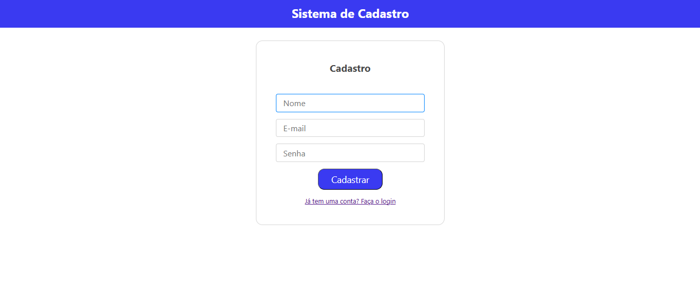
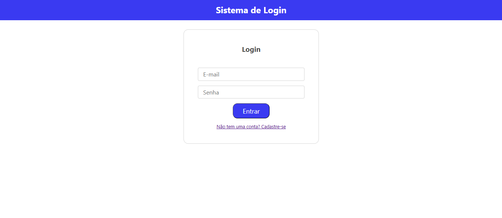
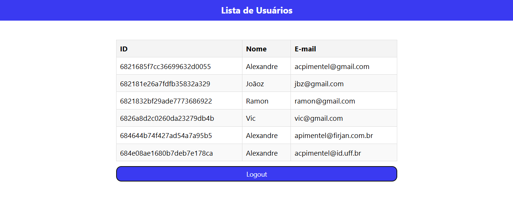

# Frontend - Sistema de Login (React + Vite + Axios)

Este projeto é o **frontend** de um sistema de autenticação, feito com **React + Vite** e integração via **Axios** com um backend em Node.js.

---

## 🚀 Tecnologias Utilizadas

- React (com Vite)
- Axios
- JavaScript (ou TypeScript, se preferir)
- localStorage para armazenar o token JWT

---
## Telas do Aplicativo Web

<br>

<br>

<br>

<br>
---

## ⚙️ Como Executar

### 1. Clone o repositório

```bash
git clone https://github.com/seu-usuario/seu-repositorio.git
```

### 2. Acesse a pasta do frontend

```bash
cd reactLogin
```

### 3. Instale as dependências

```bash
npm install
```

### 4. Configure a API

Edite o arquivo `src/services/api.js` com a URL do seu backend:

```js
import axios from 'axios';

const api = axios.create({
  baseURL: 'http://localhost:3000', // ajuste conforme necessário
});

export default api;
```

---

## 💻 Estrutura Base

```
/reactLogin
├── src/
│   ├── pages/
│   │   └── Login.jsx
│   ├── services/
│   │   └── api.js
│   ├── App.jsx
│   └── main.jsx
├── index.html
└── vite.config.js
```

---

## ✍️ Exemplo de Tela de Login

`src/pages/Login.jsx`:

```jsx
import { useState } from 'react';
import api from '../services/api';

function Login() {
  const [email, setEmail] = useState('');
  const [senha, setSenha] = useState('');

  async function handleLogin(e) {
    e.preventDefault();
    try {
      const res = await api.post('/auth/login', { email, senha });
      localStorage.setItem('token', res.data.token);
      alert('Login realizado com sucesso!');
    } catch {
      alert('Erro no login!');
    }
  }

  return (
    <form onSubmit={handleLogin}>
      <input type="email" value={email} onChange={e => setEmail(e.target.value)} placeholder="Email" />
      <input type="password" value={senha} onChange={e => setSenha(e.target.value)} placeholder="Senha" />
      <button type="submit">Entrar</button>
    </form>
  );
}

export default Login;
```

---

## 🧪 Testando

Certifique-se de que o backend (`node-backend`) está rodando corretamente na porta 3000 antes de iniciar o frontend.

Para iniciar o frontend:

```bash
npm run dev
```

Abra seu navegador em:  
👉 [http://localhost:5173](http://localhost:5173)

---

## 📌 Considerações

- O token JWT é salvo no `localStorage`.
- Você pode criar um hook ou context API para gerenciar autenticação global.
- Requisições futuras podem incluir o token no cabeçalho:

```js
api.defaults.headers.common['Authorization'] = `Bearer ${token}`;
```

---

## ✅ Melhorias Futuras

- Cadastro de usuário
- Proteção de rotas no React (React Router + auth context)
- Logout e expiração automática do token
- Design com Tailwind ou styled-components

---

## 👨‍💻 Autor

Frontend desenvolvido por **Alexandre Pimentel**.

---

## 📃 Licença

MIT License
